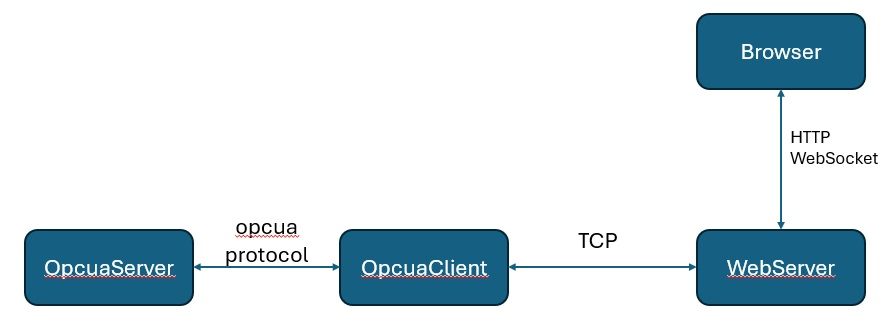
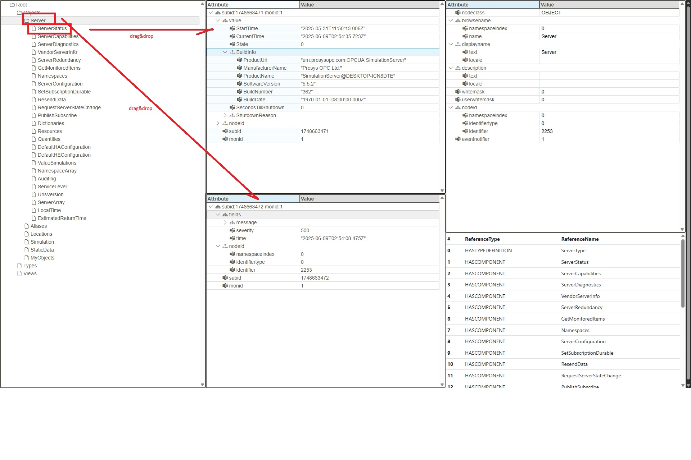

# Opcuabrowse
a practice project for learning opcua client

# Prerequirements
Tool : gcc / golang <br>
apt-get install libcurl4-openssl-dev libcjson-dev <br>

# Software architecture


# Install
Generate opcuaclient/opcuaserver
```
make;
```
Generate main(webserver)
```
cd webserver;go build -buildvcs=false ./
```

# Run
Startup your opcua server,if you don't have one for test purpose you could use opcuaserver
```
./opcuaserver
```
Startup opcuaclient , parameter is opcua server's url path
```
./opcuaclient opc.tcp://127.0.0.1:14840
```
Startup webserver , parameter is opcuaclient's ip:7000
```
./main  127.0.0.1:7000
```
startup a browser connect to  webserver
```
http://127.0.0.1:8090/site/client.html
```


## License

Licensed under the [MIT license](https://github.com/shadcn/ui/blob/main/LICENSE.md).
